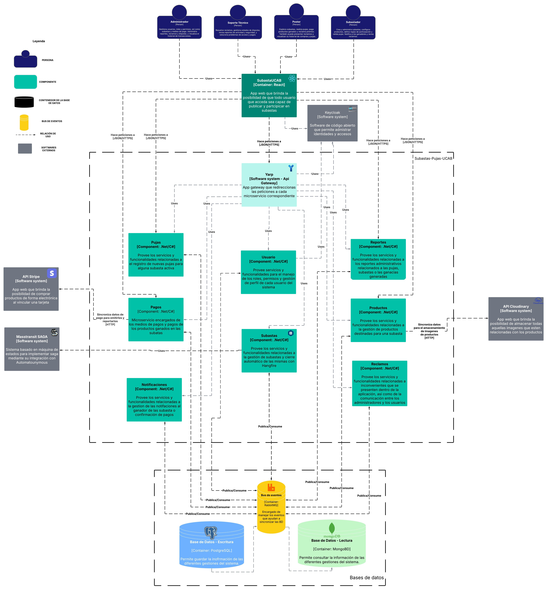

<h1 align="center">📚 Subasta UCAB</h1>

  

<i>Aplicación de subastas en tiempo real basada en microservicios con arquitectura moderna y funcionalidades avanzadas de interacción.</i>

---

## 📘 Índice

- [📖 Descripción](#descripción)
- [👥 Integrantes](#integrantes)
- [🧠 Modelo de dominio](#modelo-de-dominio)
- [🧩 Diagrama de componentes](#diagrama-de-componentes)
- [🛠️ Tecnologías](#tecnologías)
- [📄 Documentación](#documentación)

---

## 📖 Descripción

**Subasta UCAB** es una aplicación web de subastas en tiempo real desarrollada como parte del curso de **Desarrollo de Software** en la Universidad Católica Andrés Bello.  
El sistema permite a los usuarios registrarse, participar en subastas, realizar pujas en vivo, gestionar productos, realizar pagos, recibir notificaciones y resolver reclamos.

Está construida sobre una arquitectura moderna de microservicios, con procesamiento distribuido, uso intensivo de eventos, control de estados con **Sagas** y comunicación en tiempo real con **WebSockets**.

### ✅ Funcionalidades principales

#### 👥 Gestión de usuarios
- Registro, inicio de sesión y recuperación de contraseña
- Gestión de perfiles personales
- Asignación de roles (Administrador, Subastador, Postor, Soporte)
- Historial de actividad individual

#### 📦 Subastas y productos
- Crear, editar y eliminar subastas
- Asociar productos a subastas
- Reglas de subasta personalizadas (precio base, duración, incremento mínimo)
- Finalización automática con Hangfire

#### ⚡ Pujas en tiempo real
- Envío y recepción de pujas vía WebSockets
- Pujas automáticas configurables
- Actualizaciones instantáneas para todos los usuarios conectados

#### 🏁 Finalización y resultados
- Cierre automático de subasta al vencer el tiempo
- Determinación del ganador
- Notificaciones a ganador y subastador
- Publicación de resultados

#### 💳 Pagos y medios
- Registro y gestión de medios de pago
- Pagos seguros tras ganar una subasta
- Confirmación por parte del subastador
- Cancelación automática por impago

#### 📊 Reportes
- Subastas realizadas (por fecha, categoría)
- Pujas por usuario
- Pagos recibidos
- Exportación en PDF y Excel

#### 🎁 Premios y entregas
- Reclamar premios ganados
- Confirmación de entrega
- Reporte de problemas en la entrega

#### 🔧 Reclamos y soporte
- Envío de reclamos con evidencia
- Revisión y resolución por soporte
- Seguimiento de estado del reclamo

#### 🔄 Control de estados
- Gestión de estados con **MassTransit** y **Sagas**
- Estados: Pending, Active, Ended, Completed, Canceled and Deserted
- Transiciones por eventos asincrónicos

---

## 👥 Integrantes

| Foto | Nombre | Rol | GitHub | LinkedIn |
|------|--------|-----|--------|----------|
|  | **Alex Altuve** | Full Satck Developer | [@Alex‑Altuve](https://github.com/Alex-Altuve) | [🔗](https://www.linkedin.com/in/alex-altuve-delgado-b1a212288/) |
|  | **Samuel Ponce** | Backend Developer | [@ZamudiaJr](https://github.com/ZamudiaJr) | [🔗](https://www.linkedin.com/in/samuel-ponce-3a35002b0/) |
|  | **Erick Villalobos** | Frontend Developer | [@edvilllalobos](https://github.com/edvilllalobos) | [🔗](https://www.linkedin.com/in/erick‑villalobos/) |

---

## 🧠 Modelo de dominio

> Representación conceptual del área de negocio (Subastas y Pujas)

---

## 🧩 Diagrama de componentes

> Estructura de alto nivel del sistema: cómo se conectan los módulos y componentes principales.

---

## 📄 Documentación

### 📌 ERS – Especificación de Requerimientos del Software

Toda la lógica del sistema, casos de uso, reglas de negocio, restricciones, flujos de usuario y diseño funcional están descritos con detalle en el documento **ERS**.  
Este documento incluye:

- Modelo de dominio completo
- Diagrama de casos de uso
- Requerimientos funcionales y no funcionales
- Detalle de roles y permisos
- Gestión de estados con Sagas (MassTransit)
- Historias de usuario detalladas
- Flujo de pagos, reclamos y pujas en tiempo real

> 📎 [Ver documento ERS en Google Docs](https://docs.google.com/document/d/1mHnOS1DRPMgeURpBAR8vScXmstKhYvCH/edit?usp=sharing&ouid=108233334438343471200&rtpof=true&sd=true)

---

### 🧪 Estrategia de Pruebas

- Se implementaron **pruebas unitarias en todos los microservicios**, alcanzando una cobertura superior al **90%**.
- Las pruebas fueron ejecutadas como parte del flujo de integración continua.
- Se utilizó la herramienta **JetBrains ReSharper** para medir cobertura y calidad del código.

> 🎯 Módulos evaluados: Reportes, Pujas, Pagos, Productos, Reclamos, Usuario, Subasta, Notificación.

---

### 🚀 Estrategia de Despliegue

- El sistema fue desplegado utilizando **IIS (Internet Information Services)** en entorno Windows.
- Se configuró un ambiente de producción con rutas por microservicio detrás de un **gateway (YARP)**.
- Cada microservicio se publica como una aplicación independiente en IIS.
- Se utilizó la opcion de despliegue **Folder**
- Las versiones de producción se ejecutan fuera del entorno de desarrollo (requisito del proyecto UCAB).

> 🔐 Control de acceso manejado por **Keycloak**, integrado con cada microservicio mediante tokens JWT.

---

## 🛠️ Tecnologías

- **Lenguaje principal:** C#
- **Frameworks:** .NET 8, React
- **Backend & Arquitectura:**
  - Arquitectura Hexagonal
  - CQRS + Mediator
  - Sagas con MassTransit
  - Hangfire para procesos en background
  - RabbitMQ como broker de eventos
- **Base de datos:** PostgreSQL, MongoDB
- **Seguridad:** Keycloak (autenticación/autorización)
- **Almacenamiento de imagenes** Cloudinary
- **Pasarela de comunicación:** YARP Gateway
- **Pasarela de Pago:** Stripe
- **Otros:** ESLint, Swagger
